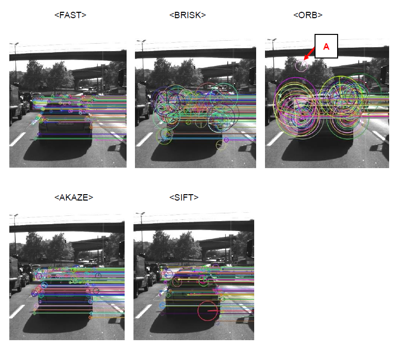
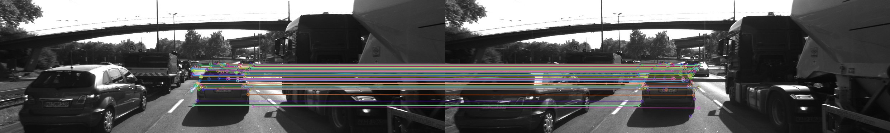

# SFND 2D Feature Tracking


## Goal
In this "Feature tracking" project, I implemented a few detectors, descriptors, and matching algorithms. 
The aim of implementing various detectors and descriptors combinations is to learn a wide range of options available in the OpenCV library.

## Overview
The steps of this project are the following:  
- (1)	The Data Buffer:   
I focused on loading images, setting up data structures and putting everything into a ring buffer to optimize memory load.  
- (2)	Keypoint Detection:  
 I integrated several keypoint detectors such as HARRIS, FAST, BRISK and SIFT and compare them with regard to number of keypoints and speed.  
- (3)	Descriptor Extraction & Matching:  
 I focused on descriptor extraction and matching using brute force and also the FLANN approach.  
- (4)	Performance Evaluation:  
 Once the code framework is complete, I tested the various algorithms in different combinations and compare them with regard to some performance measures.  

## Steps
There are 9 Tasks in this project.
### (1)The Data Buffer 
### Task MP.1
I focused on loading images, setting up data structures and putting everything into a ring buffer to optimize memory load. I modified “MidTermProject_Camera_Student.cpp” as following.

### (2)Keypoint Detection
### Task MP.2
My second task is to focus on keypoint detection. 
In the student version of the code there’s already an existing implementation of the Shi-Tomasi detector. 
I implemented a selection of alternative detectors, which are HARRIS, FAST, BRISK, ORB, AKAZE, and SIFT
in “matching2D_Student.cpp” as following.

### Task MP.3
My third task is to remove all keypoints outside of a bounding box around the preceding vehicle. 
Box parameters you should use are : cx = 535, cy = 180, w = 180, h = 150.
I implemented it in “MidTermProject_Camera_Student.cpp” as following.

### (3)Descriptor Extraction & Matching
### Task MP.4
My fourth task is to implement a variety of keypoint descriptors to the already implemented BRISK method and make them selectable using the string 'descriptorType'. The methods I must integrate are BRIEF, ORB, FREAK, AKAZE and SIFT. The SURF is not a part of the mid-term project.

### Task MP.5
My fifth task focuses on the matching part. The current implementation uses Brute Force matching combined with Nearest-Neighbor selection. I must now add FLANN as an alternative to brute-force as well as the K-Nearest-Neighbor approach.

### Task MP.6
As my sixth task, I then implement the descriptor distance ratio test as a filtering method to remove bad keypoint matches.

### (4)Performance Evaluation
### Task MP.7
My seventh task is to count the number of keypoints on the preceding vehicle for all 10 images and take note of the distribution of their neighborhood size. Do this for all the detectors you have implemented.

The the number of keypoints on the preceding vehicle for all 10 images is in the list "result/Project2_result.xlsx".

FAST and AKAZE have mostly small neighborhood sizes, and the dispersion looks small.  
BRISK and SIFT have small and large neighborhood sizes, and the dispersion looks large.  
ORB have mostly large neighborhood sizes. Only ORB has the mismatched keypoint on the tree. (A)  
Overall, FAST and AKAZE look good detector compared with others.  




### Task MP.8
My eighth task is to count the number of matched keypoints for all 10 images using all possible combinations of detectors and descriptors. 
In the matching step, use the BF approach with the descriptor distance ratio set to 0.8.

The result is in the list "result/Project2_result.xlsx".

### Task MP.9
My ninth task is to log the time it takes for keypoint detection and descriptor extraction. 
The results must be entered into a spreadsheet and based on this information I then suggest the TOP3 detector / descriptor combinations as the best choice for our purpose of detecting keypoints on vehicles. 
Finally, in a short text, I justify my recommendation based on my observations and on the data I collected.

The result is in the list "result/Project2_result.xlsx".

The time of ORB detector is short (A), but keypoints of ORB are not stable as I wrote in Task MP.7.
Besides ORB, the TOP 3 fast methods are following.   
(1) FAST detector & ORB descriptor: average 2.6 msec, standard deviation: 0.6 msec  
(2) FAST detector & BRIEF descriptor: average 3.3 msec, standard deviation: 3.7 msec  
(3) FAST detector & FREAK descriptor: average 45.7 msec, standard deviation: 2.0 msec  

(3) is more than 10 times slower than (1), (2), so it’s not a good solution.  
(2) is a little slower than (1), but the standard deviation is much larger than (1) so it’s not good either.  

## Conclusion
As a conclusion, (1)FAST detector & ORB descriptor is the best combination in this project images.  
The matching image of this combination is shown below. It looks there’s no mismatch.  


## Rubric


## Dependencies for Running Locally
1. cmake >= 2.8
 * All OSes: [click here for installation instructions](https://cmake.org/install/)

2. make >= 4.1 (Linux, Mac), 3.81 (Windows)
 * Linux: make is installed by default on most Linux distros
 * Mac: [install Xcode command line tools to get make](https://developer.apple.com/xcode/features/)
 * Windows: [Click here for installation instructions](http://gnuwin32.sourceforge.net/packages/make.htm)

3. OpenCV >= 4.1
 * All OSes: refer to the [official instructions](https://docs.opencv.org/master/df/d65/tutorial_table_of_content_introduction.html)
 * This must be compiled from source using the `-D OPENCV_ENABLE_NONFREE=ON` cmake flag for testing the SIFT and SURF detectors. If using [homebrew](https://brew.sh/): `$> brew install --build-from-source opencv` will install required dependencies and compile opencv with the `opencv_contrib` module by default (no need to set `-DOPENCV_ENABLE_NONFREE=ON` manually). 
 * The OpenCV 4.1.0 source code can be found [here](https://github.com/opencv/opencv/tree/4.1.0)

4. gcc/g++ >= 5.4
  * Linux: gcc / g++ is installed by default on most Linux distros
  * Mac: same deal as make - [install Xcode command line tools](https://developer.apple.com/xcode/features/)
  * Windows: recommend using either [MinGW-w64](http://mingw-w64.org/doku.php/start) or [Microsoft's VCPKG, a C++ package manager](https://docs.microsoft.com/en-us/cpp/build/install-vcpkg?view=msvc-160&tabs=windows). VCPKG maintains its own binary distributions of OpenCV and many other packages. To see what packages are available, type `vcpkg search` at the command prompt. For example, once you've _VCPKG_ installed, you can install _OpenCV 4.1_ with the command:
```bash
c:\vcpkg> vcpkg install opencv4[nonfree,contrib]:x64-windows
```
Then, add *C:\vcpkg\installed\x64-windows\bin* and *C:\vcpkg\installed\x64-windows\debug\bin* to your user's _PATH_ variable. Also, set the _CMake Toolchain File_ to *c:\vcpkg\scripts\buildsystems\vcpkg.cmake*.


## Basic Build Instructions

1. Clone this repo.
2. Make a build directory in the top level directory: `mkdir build && cd build`
3. Compile: `cmake .. && make`
4. Run it: `./2D_feature_tracking`.
